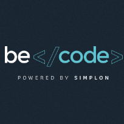
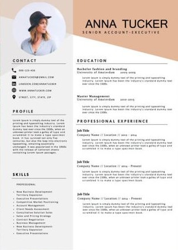

# CV

- **Author:** Paul *"makemyA"* Henrot
- **About:** Making a CV
- **Period:** *-Start: 03/06/2018-*
- **Place:** [BeCode](https://becode.org/) bootcamp @[Becentral](https://www.becentral.org/) buildings in Bruxelles

## Project Description

* **Objective**?

To be able to make a modern C.V. with html/css tools.

You can watch complete instructions [there](https://github.com/becodeorg/lovelace-2/blob/master/Parcours/01-La-prairie/html-css/5-exercice-creer-un-cv.md)

You can watch the result [here](https://makemya.github.io/Learning-Environment/5-exercice-creer-un-cv.md/)

## **Day-1**

* **Step 1**

I choice to practice my new skills in bootstrap to make a design, creative and responsive CV.

* **Step 2**

I find a nice CV on pinterest who will be my inspiration for all this work. I dont want to copy it but its easier to start with a real template. See below the cv i choice:

* **Step 3**

I use bootstrap grid technic to make the global organisation of the CV.

